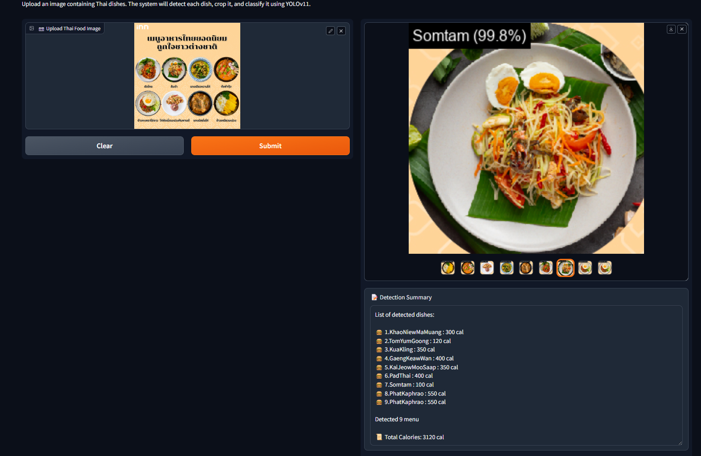

# 🍽️ Thai Food Detector & Classifier

**This project is a Thai Food Detection and Classification System developed for the course ITCS454 Special Topic in Computer Science at ICT Mahidol.**

* 1. Users can upload an image containing Thai dishes, and the system performs the following:

* 2. Detects multiple food items (plates) in the image using a YOLOv11-based object detection model.

* 3. Classifies each detected food item using a fine-tuned ResNet34 classifier trained on the THFOOD-50 dataset.

* 4. Estimates the calories for each dish based on the classification.

* 5. Displays the total calorie count of all the food items detected on the plate.

> 💡 *Tip:* This tool can support health-conscious users by helping them quickly estimate calorie intake from a single image.

## 🔧 How to Run

1. Download the dataset from [THFOOD-50](https://paperswithcode.com/dataset/thfood-50)
2. Store it in the `datasets/` directory
3. Run dataset cleaner:  
   ```bash
   python tools/datasetcleaner.py
   ```
4. Install requirements:  
   ```bash
   pip install -r requirements.txt
   ```
5. Run the application:  
   ```bash
   python app.py
   ```

> 💡 *Tip:* Use a Conda environment before installing the requirements to prevent package conflicts.

---

## 🤖 Model

- **Object Detaction Model**: `YOLO11 model N,M,L`
- Based on **YOLO11**, with all layers frozen and fine-tuned using the custom **Platefood** dataset  
- Credits: [Plate food on Robloflow](https://universe.roboflow.com/subhash-pathirana-cdryb/plate_food/dataset/1/download/yolov11)
- **Classification Base Model**: `model_best_vloss_resnet34.pth`
- Based on **ResNet34**, with all layers frozen and fine-tuned using the custom **THFOOD-50** dataset  
- Credits: [THFOOD-50 on PapersWithCode](https://paperswithcode.com/dataset/thfood-50)

---

## 🧪 Data Augmentation for Training

```python
train_trans = transforms_v2.Compose([
    transforms_v2.ToImage(),  # Convert PIL → CHW tensor
    transforms_v2.ToDtype(torch.float32, scale=True),  # Convert to float32 and scale to [0, 1]
    transforms_v2.RandomHorizontalFlip(p=0.5),
    transforms_v2.RandomApply([
        transforms_v2.ColorJitter(brightness=0.2, contrast=0.2, saturation=0.1)
    ], p=0.4),
    transforms_v2.RandomResizedCrop(size=(224, 224), antialias=True),
    transforms_v2.RandomApply([
        transforms_v2.GaussianBlur(kernel_size=3, sigma=(0.1, 0.8))
    ], p=0.2),
    transforms_v2.Normalize(mean=[0.485, 0.456, 0.406],
                            std=[0.229, 0.224, 0.225]),
])
```

---

## 🛠️ Model Modification

```python
num_ftrs = model.fc.in_features

# Add Dropout and final classifier layer
model.fc = nn.Sequential(
    nn.Dropout(p=0.3),  # Dropout to prevent overfitting
    nn.Linear(num_ftrs, len(train_ds.classes))  # Final classification layer
)
```

---

## ⚙️ Optimizer

```python
optimizer = torch.optim.AdamW(model.parameters(), lr=learning_rate)
```

---

## 🐞 Known Issues

### ❌ Dataset image file is truncated

- Use `datasetcleaner.py` to detect and remove corrupted images.


---

## Example interface

